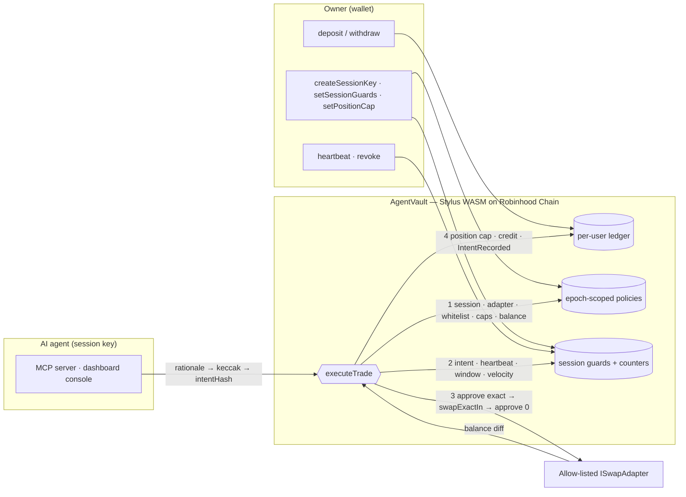

# Vigiles

**Session keys, not wallet keys — a Stylus (Rust) vault that cages AI trading agents with hard on-chain limits.**

*Vigiles* were the night watch of ancient Rome: the guards who patrolled the city while it slept. This is the night watch for an AI agent that trades while you sleep.

A Stylus (Rust → WASM) vault on Robinhood Chain (Arbitrum Orbit L2). You deposit tokenized stocks into a contract that never releases them to anyone but you, then mint a revocable *session key* for your AI agent. The agent can rotate value between the tokens you whitelist, inside limits the **contract** enforces — not a prompt, not a policy file, not a middleware. A hijacked, hallucinating or looping agent can only trade inside the cage.

> Built for the [Arbitrum Open House Singapore Buildathon](https://www.hackquest.io/hackathons/Arbitrum-Open-House-Singapore-Online-Buildathon) · Robinhood Chain track.

---

## The problem

Agentic trading is here (Robinhood Agentic Trading, MCP-connected brokers), and every agent needs signing authority to act. Wallet keys are all-or-nothing: one prompt injection, one bad tool result, one runaway loop and the agent can empty the account in a single transaction. Off-chain guardrails live in the same process as the thing they are guarding.

## What Vigiles enforces

Everything below is checked inside `executeTrade` in the Stylus contract. Guards are layered on the v2 spend-cap model; every guard defaults to *off*, so an un-configured session behaves exactly like a plain spend-capped key.

| # | Guardrail | What it stops | Why it is specific to AI agents on tokenized stocks |
|---|---|---|---|
| 1 | **Per-trade + rolling-24h caps** per token (linear token-bucket refill) | Oversized orders; midnight double-dipping | Bounds the sell side |
| 2 | **Token + venue whitelist** (epoch-scoped, wiped on revoke) | "Move everything into X"; routing through an unknown DEX | The agent literally cannot reference anything else |
| 3 | **Trading window** — UTC open/close + weekday mask | Trading a thin 3am Sunday book | Tokenized stocks trade 24/5, but liquidity follows NYSE |
| 4 | **Velocity limit** — max trades per rolling hour | A stuck agent firing 200 orders and bleeding slippage | LLM agents fail by *repetition*, not just size |
| 5 | **Position cap** — max holding per ticker | Piling the whole vault into one name | Bounds the *buy* side the way daily caps bound the sell side |
| 6 | **Dead-man switch** — heartbeat interval | "User walked away for a week, agent kept going" | "A human is still watching" becomes an on-chain predicate |
| 7 | **Intent receipts** — `keccak256(rationale)` required on every trade | Untraceable decisions; rewritten logs | The agent commits to *why* before it can act; the log is tamper-evident |

Plus the v2 foundation: revocation with epoch bump, reentrancy lock on every mutating entrypoint, balance-diff settlement (the vault measures what a venue actually took and returned), exact approve → swap → approve-to-zero, and zero `unsafe` Rust.

## Security model in one paragraph

A fully compromised agent holding a valid session key can: trade whitelisted tokens for other whitelisted tokens, through allow-listed adapters, up to `perTradeCap` per order, `dailyCap` per rolling day, `maxTradesPerHour`, inside the trading window, while the owner keeps heartbeating, never exceeding a position cap, and only with a rationale hash attached. It cannot withdraw, cannot touch other users' balances, cannot use another venue, cannot trade a token outside the list, and stops the moment the owner revokes (one transaction) or goes silent. **Honest worst case without an oracle floor:** the agent trades the daily caps at bad prices — the UI shows this number (`Σ dailyCap × reference price`) before you grant the key.

## Architecture



Every guard is a pure function in [`risk_engine.rs`](vigiles-vault/src/risk_engine.rs) (VM-free, unit-tested), called from the entrypoints in [`lib.rs`](vigiles-vault/src/lib.rs). [`AgentVaultSolidityReference.sol`](contracts/src/AgentVaultSolidityReference.sol) is a line-for-line EVM twin so the Foundry suite (hostile adapters, fuzz, invariants) exercises the same rules.

## Verified numbers

All reproducible from a clean checkout (see *Running locally*).

| Check | Result |
|---|---|
| Stylus WASM (nightly, `panic=immediate-abort`) | **85,108 B raw · 22,786 B brotli** — under the 128 KiB / 24 KiB limits |
| `unsafe` blocks in contract code | 0 |
| Rust tests — pure risk engine + `TestVM` against the real contract | **24 passed** |
| Foundry — unit, hostile adapters (Thief/Greedy/Reentrant/Stingy/PartialFill), exploit regressions, oracle guard, v3 guardrails, fuzz, invariants (`Solvency`, `BobIsolation` · 256 runs · 128,000 calls) | **51 passed** |
| Clippy `-D warnings` on `wasm32-unknown-unknown` | clean |

The size numbers matter: the previous build of this vault compressed to ~30 KB, which **cannot be deployed** (EIP-170). Getting a 19-function contract with ten events and 24 custom errors under 24 KiB took a limb-wise `U256 / u64` division (replacing 4.4 KB of `ruint` code) and building `core` with the `immediate-abort` panic strategy (removing ~10 KB of `core::fmt` that panics keep alive through function pointers). Details in [`vigiles-vault/.cargo/config.toml`](vigiles-vault/.cargo/config.toml).

Two bugs found on the way and fixed: the `#[public]` macro was exporting the private `reentrancyGuardEnter()` helper, so **anyone could brick the vault with one call**; and `executeTrade`'s `data` was ABI-typed `uint8[]` instead of `bytes`. Both are covered by the exported-ABI diff check in CI.

## Deployment

Addresses live in **[`deployments/robinhood-testnet.json`](deployments/robinhood-testnet.json)** — the single source of truth read by the dashboard and the MCP server. If `agentVault` is `null` there, the vault is not deployed yet and the dashboard runs in a clearly-labelled simulation with identical rules.

```bash
# 1. Vault (Stylus). Dry-run = build + `cargo stylus check`; add a key file to deploy + activate.
./scripts/deploy_stylus.sh
PRIVATE_KEY_PATH=./key.txt ./scripts/deploy_stylus.sh

# 2. Tokenized-stock mocks + swap adapter (Foundry).
PRIVATE_KEY=0x... ./scripts/deploy_mocks.sh
```

Requirements: Rust nightly with `rust-src` + `wasm32-unknown-unknown`; `cargo-stylus` (or Docker — the script falls back to `offchainlabs/cargo-stylus-base`); Foundry; a funded key on Robinhood Chain testnet (chain id 46630, RPC `https://rpc.testnet.chain.robinhood.com`, explorer `https://explorer.testnet.chain.robinhood.com`).

## Three-minute demo

1. **Deposit** 25 AAPL into the vault (dashboard, panel 01).
2. **Grant** a session key to the in-browser agent: AAPL + TSLA, 5 per trade, 20 per day, TSLA max holding 12 (panel 02). Read the *worst case per day* figure.
3. **Apply guardrails**: 5 trades/hour, 24 h heartbeat. Toggle *NYSE hours* to see the 24-hour strip and the live "vault says now" verdict flip.
4. **Execute** one trade with a rationale → `TradeExecuted` + `IntentRecorded` appear in the ledger with explorer links.
5. **Attack the cage** (panel 03), in order: prompt injection → `TokenNotAllowed`; oversized order → `SpendLimitExceeded`; rogue venue → `AdapterNotAllowed`; no rationale → `MissingIntent`; concentrate → `PositionCapExceeded` on the second fill; runaway loop → `VelocityLimitExceeded` after the budget.
6. **Ledger → intents**: paste a rationale and watch it verify against the on-chain hash; alter one character and watch it fail.
7. **Revoke.** Epoch bumps; every policy and cap is gone in one transaction.

## Repository

```
vigiles-vault/     Stylus contract (Rust). src/lib.rs entrypoints, src/risk_engine.rs pure guards + tests
  .cargo/config.toml    build-std + immediate-abort (size)
contracts/              Foundry: Solidity reference twin, mocks, 51 tests incl. invariants, DeployMocks script
  src/IAgentVaultStylus.sol   exact ABI of the deployed Stylus vault (generated; CI diffs it)
frontend/               Next.js dashboard. lib/onchain.ts (viem), lib/sim.ts (same rules, in-memory), lib/guards.ts (TS port)
mcp/                    MCP server (official SDK): status · preflight · execute_trade · intent_log
deployments/            robinhood-testnet.json — addresses, written by the deploy scripts
scripts/                deploy_stylus.sh / .ps1, deploy_mocks.sh
```

## Running locally

```bash
# Contracts
cd contracts && forge test -vv

# Stylus vault (host tests on stable; WASM build needs nightly + rust-src)
cd vigiles-vault
cargo test --lib
cargo +nightly build --release --target wasm32-unknown-unknown
cargo +nightly clippy --target wasm32-unknown-unknown -- -D warnings
cargo run --features export-abi        # Solidity interface of the deployed ABI

# Dashboard (simulation until deployments/robinhood-testnet.json is filled)
cd frontend && npm install && npm run dev

# MCP server (Claude Desktop / Cursor): add to your MCP config
#   { "vigiles": { "command": "npx", "args": ["tsx", "/abs/path/mcp/server.ts"],
#                      "env": { "AGENT_PRIVATE_KEY": "0x<agent session key>" } } }
cd mcp && npm install && npm start
```

### MCP tools

| Tool | Purpose |
|---|---|
| `vigiles_status` | The agent's cage: session, guards, caps, position caps, `canTradeNow` |
| `vigiles_preflight` | `eth_call` dry-run; returns the refusing guard and what to do about it. No gas. |
| `vigiles_execute_trade` | Requires a `rationale`; simulates, sends, appends to `~/.vigiles/intents.jsonl` |
| `vigiles_intent_log` | Verifies every local rationale against on-chain `IntentRecorded` hashes |

The agent's private key is read from `AGENT_PRIVATE_KEY`, used to sign, and never returned in any tool result.

## Design notes

- **Guards are session-scoped, not epoch-scoped.** Re-issuing a key wipes token policies and position caps (epoch bump) but keeps the window/velocity/heartbeat settings — guards can only ever make an agent *more* restricted, so carrying them across rotations is the safe default.
- **Guard order is fixed and documented**: session → adapter → whitelist → per-trade → daily bucket → balance → intent → heartbeat → window → velocity → *swap* → position cap. A refused trade rolls back every counter, so a rejected order never consumes velocity budget (tested).
- **Oracle price floor** (Chainlink feed + L2 sequencer uptime) exists in the Solidity reference and its tests. It is *not* in the Stylus build yet: there are no Chainlink feeds for tokenized stocks on Robinhood testnet, and the extra `sol_interface!` would cost ~6 KB of a budget we finished with ~1.7 KB to spare. It is the first item below.

## Roadmap

1. Oracle floor in Stylus once feeds exist on Robinhood Chain (or via a permissioned attestor).
2. Drawdown circuit breaker — auto-pause when oracle-valued portfolio drops N% in 24 h.
3. ERC-7715 / EIP-7702 packaging so the vault is a permission module rather than a custodial contract.
4. Corporate-action pause — freeze a ticker while a split/dividend multiplier is pending.

## License

MIT
