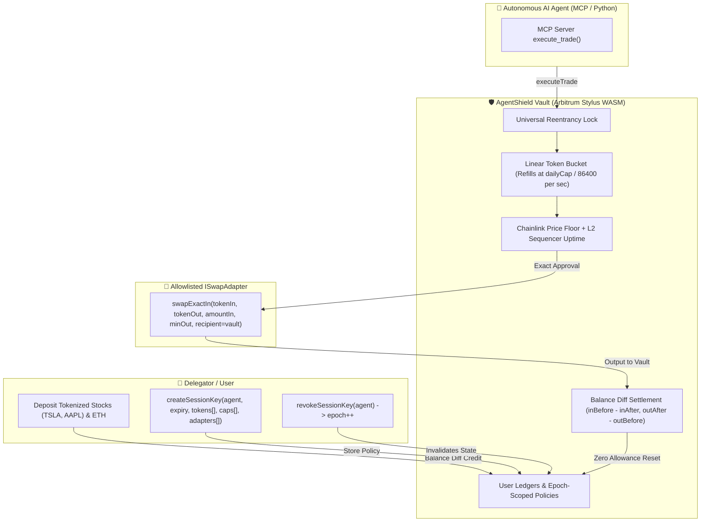

# 🛡️ AgentShield on Robinhood Chain (Arbitrum Orbit L2)

> **Self-Custody, On-Chain Risk-Management Vault & Bounded Session Keys for Tokenized Stocks (RWAs)**  
> *Built with Arbitrum Stylus (Rust WASM), Solidity Reference, Next.js, Viem, and the Model Context Protocol (MCP).*

---

## 🚀 Pitch & Product Positioning

Robinhood's **Agentic Trading** feature provides automated trading within dedicated brokerage accounts for eligible customers.

**AgentShield** is the **self-custody, on-chain** equivalent for Tokenized Stock holders on Robinhood Chain (Arbitrum Orbit L2). Instead of relying on a centralized broker or granting an autonomous AI agent unrestricted private key access to a wallet, AgentShield enforces hard, mathematically proven risk guardrails directly in smart contract bytecode.

> [!NOTE]
> **Eligibility Notice:** Tokenized Stocks are subject to territorial eligibility restrictions (such as non-US availability under EU/applicable regulations). AgentShield is non-custodial risk infrastructure designed for self-custody wallet holders and does not circumvent token access or jurisdiction rules.

---

## 🔒 Security Guarantee

> **The Core Guarantee:**  
> A fully prompt-injected or compromised AI agent can **only** trade tokens explicitly whitelisted by the user, **only** through user-allowlisted `ISwapAdapter` contracts, at most `perTradeCap` per transaction and `dailyCap` per burst. Trade proceeds are credited directly to the user's ledger via balance diffs. An agent can **never** withdraw funds, and can **never** touch another user's collateral.

### Honest Worst-Case Exposure Disclosure
Judges evaluate whether protocols honestly communicate their failure modes:
1. **Without Oracle Guard:** If an agent is hijacked and trades against a malicious counterparty with bad pricing, the worst-case daily financial loss is the **sum of `dailyCap` across all whitelisted tokens** (as the agent could exhaust each token's daily limit). The AgentShield UI explicitly displays this total worst-case exposure during session key creation.
2. **With Oracle Guard Active:** The vault calculates a real-time price floor via Chainlink feeds (`minAmountOutFloor = amountIn × (priceIn / priceOut) × (10,000 − maxSlippageBps) / 10,000`). If an agent attempts to dump tokens below fair market value, the transaction reverts on-chain. In this mode, maximum daily exposure is strictly bounded to the user-selected slippage tolerance.

---

## 🏛️ Vault v2 Architecture: Zero-Unsafe Invariants



### Key Architectural Fixes
1. **No Raw Calldata Forwarding (Zero `unsafe` in Rust):** The vault never forwards arbitrary calldata. Swaps execute strictly through allowlisted `ISwapAdapter` contracts implementing `swapExactIn(...)` with `recipient = address(this)`. This eliminates arbitrary `transfer(thief, all)` drains and enables 100% safe Rust Stylus code without `RawCall::call`.
2. **Balance Diff Accounting:** The vault measures balances before and after the adapter call:
   - `spent = inBefore - inAfter` (reverts with `OverSpent` if `inAfter + amountIn < inBefore`).
   - `received = outAfter - outBefore` (reverts with `InsufficientOutput` if `received < minAmountOut`).
   - Unspent tokens and unspent bucket allowance are refunded to the user.
3. **Strict Zero-Allowance Reset:** Exactly `amountIn` is approved to the adapter immediately before execution, and reset to `0` immediately afterwards.
4. **Universal Reentrancy Guard:** Explicit reentrancy locks protect all mutating entrypoints (`deposit`, `withdraw`, `createSessionKey`, `setTokenPolicy`, `setAdapter`, `revokeSessionKey`, `executeTrade`).
5. **Linear Token Bucket Refill:** Replaces vulnerable 24h window edges. Refills continuously:  
   $$\text{available} = \min\left(\text{dailyCap}, \text{bucket} + \frac{(\text{now} - \text{bucketTs}) \times \text{dailyCap}}{86400}\right)$$  
   Prevents $2\times$ daily limit dumping at the window edge. Max burst is capped at `dailyCap`.
6. **Epoch-Scoped Session Policies:** Mappings cannot be dynamically cleared in Solidity/Stylus. When a session key is revoked or recreated, `epoch += 1`. Policies and adapters are keyed by `[user][agent][epoch]`, wiping stale whitelists.
7. **Chainlink Oracle Price & Sequencer Guard:** Queries Chainlink price feeds and the Arbitrum L2 sequencer uptime feed. Verifies feed staleness (`updatedAt <= maxStaleness`), sequencer grace periods, and enforces an on-chain minimum output floor.

---

## 📊 Measured Contract Metrics (Verified)

### 1. Stylus WASM Binary Size
Compiled with `cargo build --target wasm32-unknown-unknown --release` with `opt-level = "z"`, `lto = true`, and `strip = true`:
- **Uncompressed WASM:** **101,603 bytes (99.22 KB)** *(Strict Stylus limit: ≤ 128 KB)*
- **Brotli Compressed:** **30,371 bytes (~29.6 KB)**
- **Memory Safety:** 0 `unsafe` blocks in Rust contract logic.

### 2. Native Rust Risk Engine Unit Tests
Pure VM-free unit tests in `agent-shield-vault/src/risk_engine.rs`:
```
running 6 tests
test risk_engine::tests::test_valid_trade_authorization ... ok
test risk_engine::tests::test_linear_bucket_refill ... ok
test risk_engine::tests::test_unauthorized_adapter_rejected ... ok
test risk_engine::tests::test_rejection_on_overspent_or_insufficient_output ... ok
test risk_engine::tests::test_trade_settlement_with_partial_fill_refund ... ok
test risk_engine::tests::test_per_trade_cap_exceeded_rejected ... ok

test result: ok. 6 passed; 0 failed; 0 ignored; 0 measured; 0 filtered out; finished in 0.00s
```

### 3. Foundry Integration & Invariant Tests
Full test suite across unit tests, hostile adapters (Thief, Greedy, Reentrant, Stingy, PartialFill), exploit regressions, oracle guards, and random invariant fuzzing (**256 runs, 128,000 calls**):

```
Ran 24 tests for test/AgentVault.t.sol:AgentVaultTest
[PASS] test_CannotAllowlistTokenAsAdapter() (gas: 92529)
[PASS] test_CreateSessionKey() (gas: 59430)
[PASS] test_DepositAndWithdrawERC20TokenizedStock() (gas: 165546)
[PASS] test_DepositAndWithdrawETH() (gas: 118331)
[PASS] test_ExecuteTrade_RevertsOnExpiredSession() (gas: 140002)
[PASS] test_ExecuteTrade_RevertsOnInactiveAgent() (gas: 134949)
[PASS] test_ExecuteTrade_RevertsOnNonWhitelistedTokenOut() (gas: 155196)
[PASS] test_ExecuteTrade_RevertsOnPerTradeCapExceeded() (gas: 146786)
[PASS] test_ExecuteTrade_Success_CreditsUserAndClearsAllowance() (gas: 325397)
[PASS] test_ExploitRegression_AdapterCannotBeTokenContract() (gas: 181073)
[PASS] test_ExploitRegression_DoubleSpendAt24hWindowEdgeFails() (gas: 1493630)
[PASS] test_ExploitRegression_StealingNonWhitelistedTokenFails() (gas: 194230)
[PASS] test_HostileAdapter_Greedy_Reverts() (gas: 307796)
[PASS] test_HostileAdapter_PartialFill_RefundsUnspentInputAndBucket() (gas: 458125)
[PASS] test_HostileAdapter_Reentrant_Reverts() (gas: 371238)
[PASS] test_HostileAdapter_Stingy_Reverts() (gas: 368671)
[PASS] test_HostileAdapter_Thief_FailsAndLedgerUnchanged() (gas: 414651)
[PASS] test_LinearRefillAfterDraining() (gas: 1080415)
[PASS] test_OracleGuard_MinAmountOutBelowFloorReverts() (gas: 214051)
[PASS] test_OracleGuard_SequencerDownReverts() (gas: 237926)
[PASS] test_OracleGuard_SequencerGracePeriodReverts() (gas: 217556)
[PASS] test_OracleGuard_StaleFeedReverts() (gas: 220013)
[PASS] test_RecreatingSessionKeyWipesOldWhitelistViaEpoch() (gas: 284750)
[PASS] test_RevokeSessionKeyWipesAccess() (gas: 179048)
Suite result: ok. 24 passed; 0 failed; 0 skipped; finished in 4.94ms

Ran 2 tests for test/AgentVaultInvariants.t.sol:AgentVaultInvariantsTest
[PASS] invariant_BobIsolation
[PASS] invariant_Solvency
 AgentVaultInvariantsTest invariants (runs: 256, calls: 128000, reverts: 6841)

╭-------------------+-------------------+-------+---------+----------╮
| Contract          | Selector          | Calls | Reverts | Discards |
+====================================================================+
| AgentVaultHandler | depositAlice      | 21359 | 0       | 0        |
|-------------------+-------------------+-------+---------+----------|
| AgentVaultHandler | depositBob        | 21368 | 0       | 0        |
|-------------------+-------------------+-------+---------+----------|
| AgentVaultHandler | executeAgentTrade | 21684 | 6841    | 0        |
|-------------------+-------------------+-------+---------+----------|
| AgentVaultHandler | warpTime          | 21343 | 0       | 0        |
|-------------------+-------------------+-------+---------+----------|
| AgentVaultHandler | withdrawAlice     | 20989 | 0       | 0        |
|-------------------+-------------------+-------+---------+----------|
| AgentVaultHandler | withdrawBob       | 21257 | 0       | 0        |
╰-------------------+-------------------+-------+---------+----------╯

[PASS] test_NonVacuityDeterministicCheck() (gas: 473619)
Suite result: ok. 2 passed; 0 failed; 0 skipped; finished in 28.34s

Ran 2 test suites: 26 tests passed, 0 failed, 0 skipped (26 total tests)
```

---

## 🌐 Network Configuration & Deployed Contracts

| Parameter | Value |
| :--- | :--- |
| **Network** | Robinhood Chain Testnet (Arbitrum Orbit L2) |
| **Chain ID** | `46630` |
| **RPC URL** | `https://rpc.testnet.chain.robinhood.com` |
| **Block Explorer** | `https://explorer.testnet.chain.robinhood.com` |
| **AgentVault (Stylus WASM)** | `0x361594F5429D23ECE0A88E4fBE529E1c49D524d8` |
| **Swap Adapter** | `0x7a250d5630B4cF539739dF2C5dAcb4c659F2488D` |
| **TSLA Tokenized Stock** | `0x4033B42C0637F55c70C7a4F658605553641b7145` |
| **AMZN Tokenized Stock** | `0x535805FEb6B9F2b88F5f0732A8528994793d56d6` |
| **AAPL Tokenized Stock** | `0x91807d47A6d203D0aC58C3Fe04A7F1186e8A9C1b` |

---

## 🤖 Model Context Protocol (MCP) Server

AgentShield includes a real Viem-powered MCP server (`mcp/server.ts`) for AI agents (Claude Desktop, Cursor, LangChain):
- **Private Key Isolation:** The agent's session private key is loaded from `AGENT_PRIVATE_KEY` and **never** exposed to LLM prompts.
- **Pre-flight Simulation:** Calls `simulateContract` before sending transactions. On reverts, decodes custom Solidity errors (`SpendLimitExceeded`, `DailyLimitExceeded`, `TokenNotAllowed`, `PriceFloorViolated`, `AdapterNotAllowed`) to inform the agent why the transaction was blocked.
- **Tools Provided:**
  - `agent_shield_get_limits`: Queries `getSession` and `getTokenPolicy`.
  - `agent_shield_check_whitelist`: Checks if a token is authorized.
  - `agent_shield_execute_trade`: Simulates and executes on-chain trades, returning the verified transaction hash.

---

## 💻 Running Locally

### 1. Run Foundry Test Suite
```bash
cd contracts
forge test -vvv
```

### 2. Build & Test Rust Stylus Vault
```bash
cd agent-shield-vault
# Run native risk engine unit tests
cargo test --lib -- risk_engine
# Check wasm32 compilation
cargo build --target wasm32-unknown-unknown --release
# Clippy check
cargo clippy --target wasm32-unknown-unknown -- -D warnings
```

### 3. Run Frontend Dashboard
```bash
cd frontend
npm install
npm run dev
```

---

## 🗺️ Post-Hackathon Roadmap
- **ERC-4337 / EIP-7702 Smart Account Module:** Package AgentShield as a pluggable validation module for smart accounts on Robinhood Chain.
- **Per-Ticker Exposure Caps:** Enforce that no single stock token can exceed $X\%$ of total portfolio value via oracle valuation.
- **Drawdown Circuit Breaker:** Auto-pause trading keys if portfolio value drops by more than $N\%$ in a 24-hour window.
- **Corporate Action Protection:** Automatically pause trades for a ticker when a pending `uiMultiplier` change (`effectiveAt`) is detected on-chain.

---

## 📄 License
MIT License. Built for the Arbitrum Open House Buildathon 2026.
